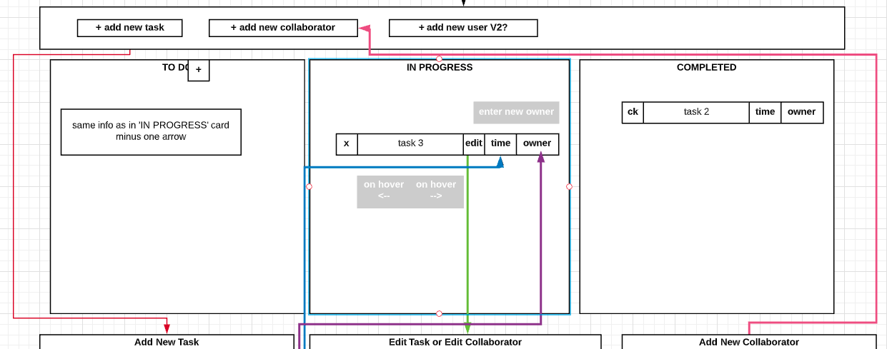
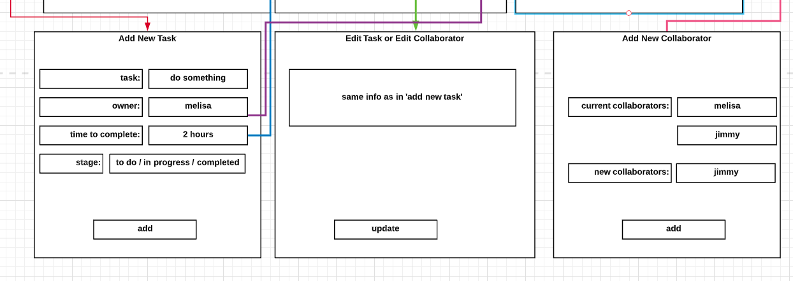

# Project One (easyDo)

### __USER STORY__

User will see 4 sections on displayed

1. Toolbar
  - plus symbol / add new task  = takes user to the add a new task page
  - plus symol / add new collaborator  = takes user to the add a new collaborator page 
  - V2? plus symbol / add new user  = takes user to the add a new user page
  - V2? Sorting and Filtering

2. To do
  - plus symbol  = takes user to the add a new task page 
  - X symbol = to remove task
  - Task name  = displays name of task (comes from new task page)
  - Edit = takes use to the edit task page
  - Time = displays time to complete task (comes from new task page)
  - Owner = displays name of team member responsible for the task

3. In progress 
  - Task name  = displays name of task (comes from new task page)
  - X symbol = to remove task
  - Edit = takes use to the edit task page
  - Time = displays time to complete task (comes from new task page)
  - Owner = displays name of team member responsible for the task

4. Completed 
  - Check mark = indicates task was completed
  - Task name  = displays name of task (comes from new task page)
  - Time = displays time to complete task (comes from new task page) 
  - Owner = displays name of team member responsible for the task

###### __Reference 'add new task' 'Edit' and 'add new collaborator' above__
###### plus symbol / add new task  = takes user to the add a new task page
######  - Task = user enters name of task
######  - Owner = user assigns team member to the task (if no owners, click +)
######  - Time = user enters estimate on time to complete task
######  - Stage = user can move the task from section to section (to do, in progress, completed)
###### - Add = user clicks and a new task is populated in the to do section

###### Edit = takes use to the edit task page
###### - Same as add task for (task, owner, time, stage)
###### - Update button = user clicks and a current task is updated and potentially moved

###### plus symbol / add new collaborator  = takes user to the add a new collaborator page
######  - Current collaborators = list of names
######  - New collaborator = enter new name
######  - Add = user clicks to add new collaborator

### __ERD__
<!-- erd table start -->
<table>

<thead>
<tr>
<th>Tasks</th>
<th>Collaborators</th>
<th>V2 Projects</th>
</tr>
</thead>

<tbody>
<tr>
<td>Name STRING</td>
<td>Name STRING</td>
<td>Name STRING</td>
</tr>

<tr>
<td>Collaborator (O-M) REF
</td>
<td>Static Picture STRING</td>
<td>Collaborators (M-M) REF
</td>
</tr>

<tr>
<td>Completion Time STRING</td>
<td>Tasks (M-O) REF
</td>
<td>Tasks (M-O) REF
</td>
</tr>

<tr>
<td>Stage STRING</td>
<td>V2 Projects (M-M) REF
</td>
<td>Start Date DATE</td>
</tr>

<tr>
<td>V2 project (O-M) REF
</td>
<td>V2 username/pass REF
</td>
<td>End Date DATE</td>
</tr>
</tbody>

</table>
<!-- erd table end -->

### __WIRE FRAME__

### __SCHEDULE__
<!-- schedule table start -->
<table>

<thead>
<tr>
<th>DAY</th>
<th>TASKS</th>
</tr>
</thead>

<tbody>
<tr>
<td>Friday</td>
<td>finish all M+J (MVC and core files)</td>
</tr>

<tr>
<td>Saturday</td>
<td>
  Model (Melisa) 
  Controllers - tasks (Melisa) 
  Pull collaborators data into tasks controllers (Melisa) 
  Views - Tasks (Jimmy) 
  Collaborators (M-M) REF 
</tr>

<tr>
<td>Sunday</td>
<td>
  Controllers - tasks (Melisa) 
  Controllers - Collaborators (Melisa) 
  Views - Collaborators/Forms (Jimmy) 
</td>
</tr>

<tr>
<td>Monday</td>
<td>
  Finalize both controllers (Melisa) 
  Views - Tasks Animation (jimmy) 
</td>
</tr>

<tr>
<td>Tuesday</td>
<td>
  v1 (mvp) review and confirm. Push to master as v1 
  v1.5 welcome screen(Melisa and Jimmy) 
  v1.5 animation (Melisa and Jimmy) 
  v1.5  
    Melisa - Projects/Users - Controller 
    Jimmy - Projects/Users - Views 
  v1.5 review and confirm. Push to master as v1.5 
</td>
</tr>

<tr>
<td>Wednesday</td>
<td>
  v2 Choose features to work on in Next Versions -> V2 
  More V2 
</td>
</tr>

<tr>
<td>Thursday</td>
<td>
  v2 Finish up 
  v2 Review and Confirm. Push to master as v2 
  Turn in by 4pm (preferably 3pm 
</td>
</tr>

</tbody>

</table>
<!-- schedule table end -->

### __TASK DISTRIBUTION__
<!-- task distribution table start -->
<table>

<thead>
<tr>
<th>Work Distribution - Option 1 (by models)</th>
<th>Work Distribution - Option 2 (J front M back)</th>
</tr>
</thead>

<body>
<tr>
<td>
CONTROLLERS  
  - tasksController  -  Jimmy 
  - collaboratorsController  -  Melisa 
MODELS  
  - Task  -  Jimmy 
  - Collaborator  -  Melisa 
  - index  -  M+J 
VIEWS 
  -Tasks 
    -index   -  Jimmy 
    -show  -  Jimmy 
    -new  -  Jimmy 
    -edit  -  Jimmy 
  -Collaborators 
    -index   -  Melisa 
    -show  -  Melisa 
    -new  -  Melisa 
    -edit  -  Melisa 
  -index  -  M+J 
Server.js  -  M+J 
PUBLIC 
  -images  -  Jimmy 
  -app.js  -  Melisa 
  -styles.css  -  Jimmy 
   
   
</td>

<td>
CONTROLLERS 
- tasksController*  -  Melisa (V2 M+J) 
- collaboratorsController  -  Melisa 
MODELS 
- Task  -  Melisa 
- Collaborator  -  Melisa 
- index  -  M+J 
VIEWS 
- Tasks 
  - index   -  Jimmy 
  - show  -  Jimmy 
  - new  -  Jimmy 
  - edit  -  Jimmy 
- Collaborators 
  - index   -  Jimmy 
  - show  -  Jimmy 
  - new  -  Jimmy 
  - edit  -  Jimmy 
-index  -  M+J 
Server.js  -  M+J 
PUBLIC 
- images  -  Jimmy 
- app.js  -  Melisa 
- styles.css  -  Jimmy 
 
*tasksController will populate collaborators 
</td>
</tr>
</body>

</table>
<!-- task distribution table end -->

### __NEXT VERSIONS__
- __V1.5__
  - User is welcomed by an banner and 
    - Button to create a project
    - See a list of current projects
  - When clicking on ‘create project’ the use is prompted to fill out information about the project 
	  - Name, collaborators, start date, end date
	  - Then user clicks add new project
  - Hover - in progress

- __V2__
  - Users
	  - Sign in/out
	  - Filter by user
  - Sorting tasks
	  - Filter by user
  - Drag and drop tasks
  - Priority
  - Animation upon task completion
  - DB - collection of projects (maybe v1)
  - Hide completed tasks
